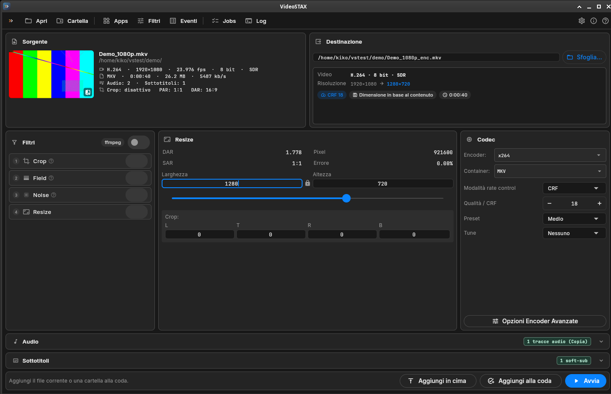
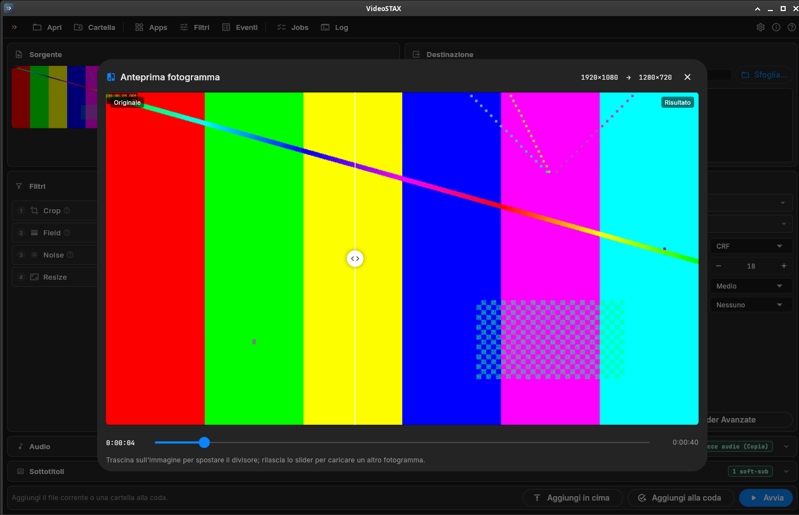
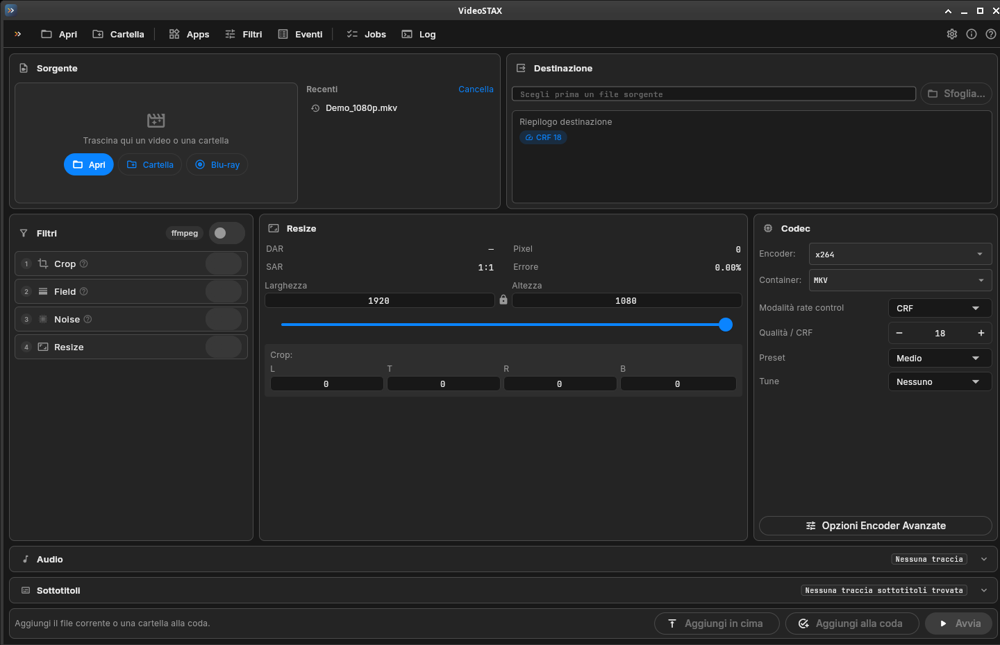
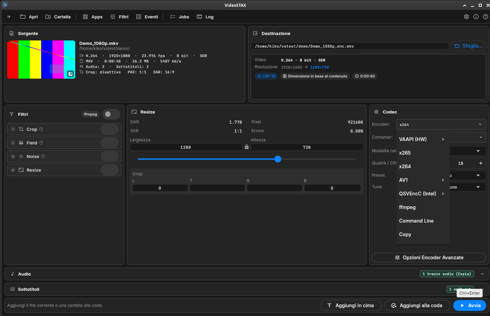
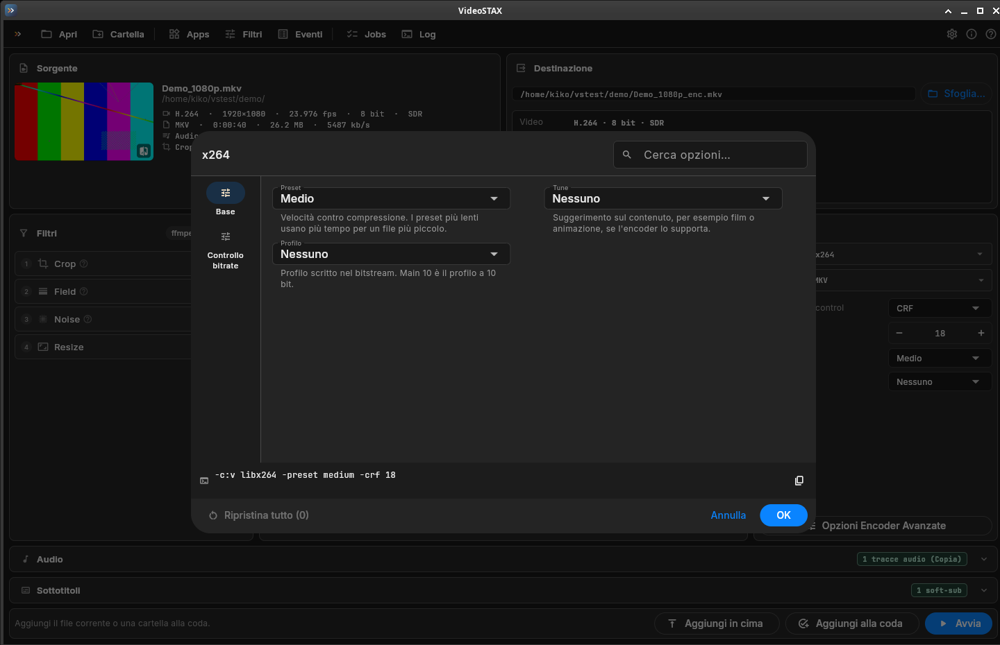
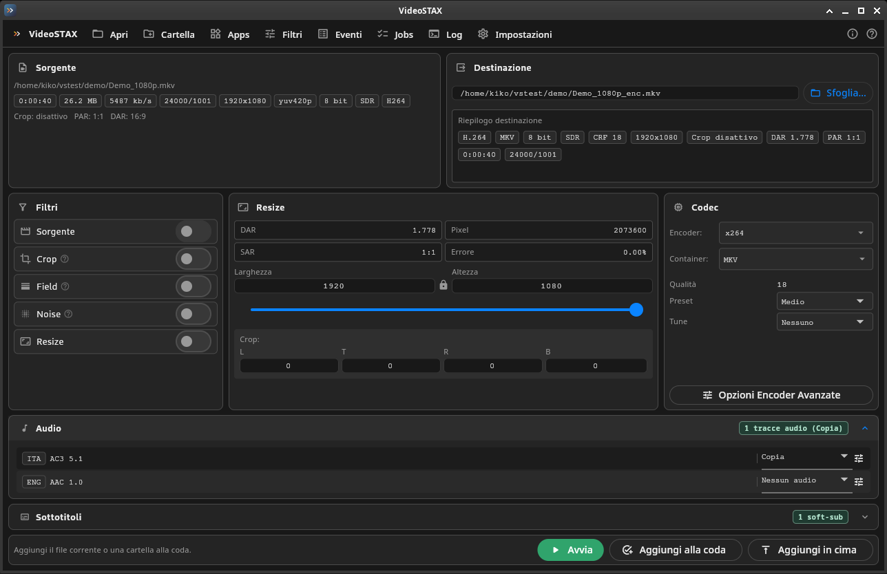
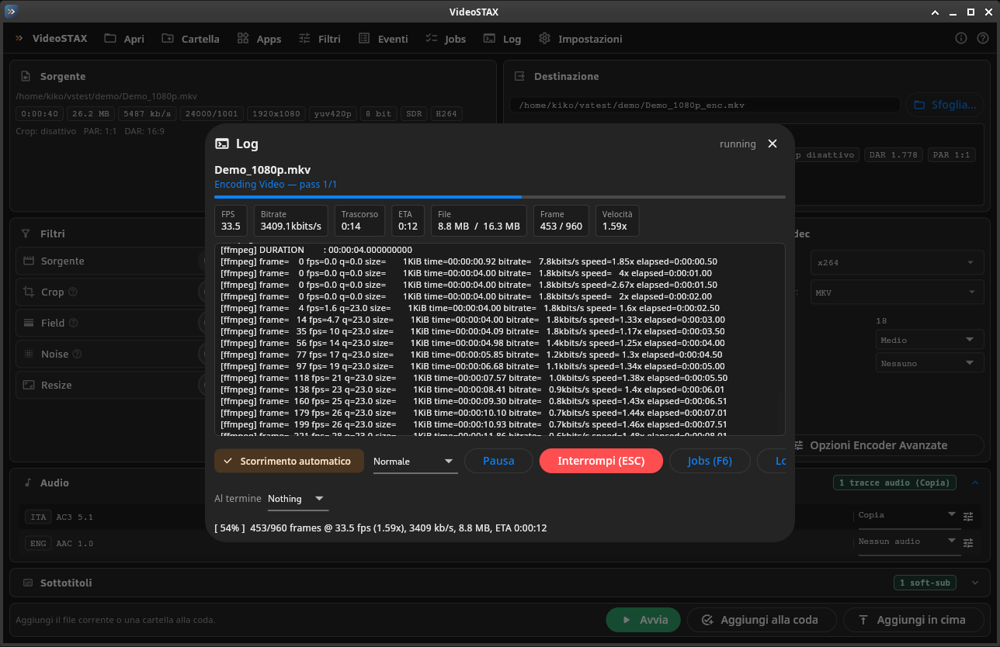
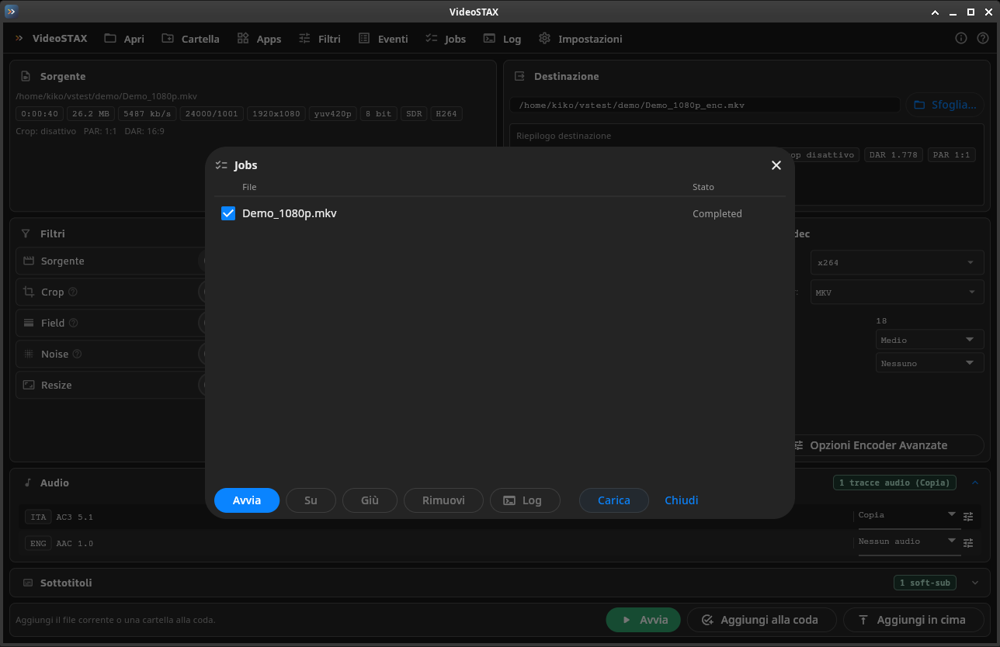
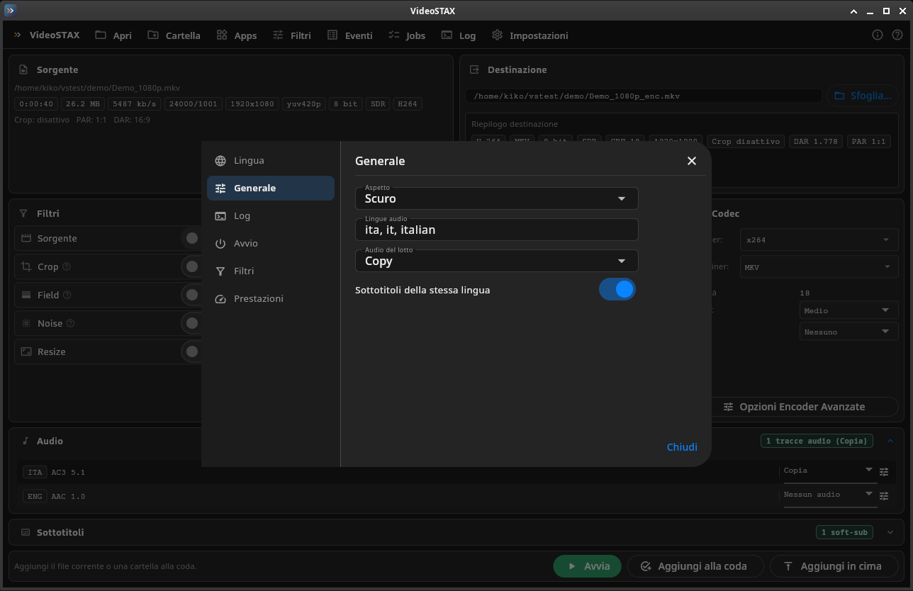
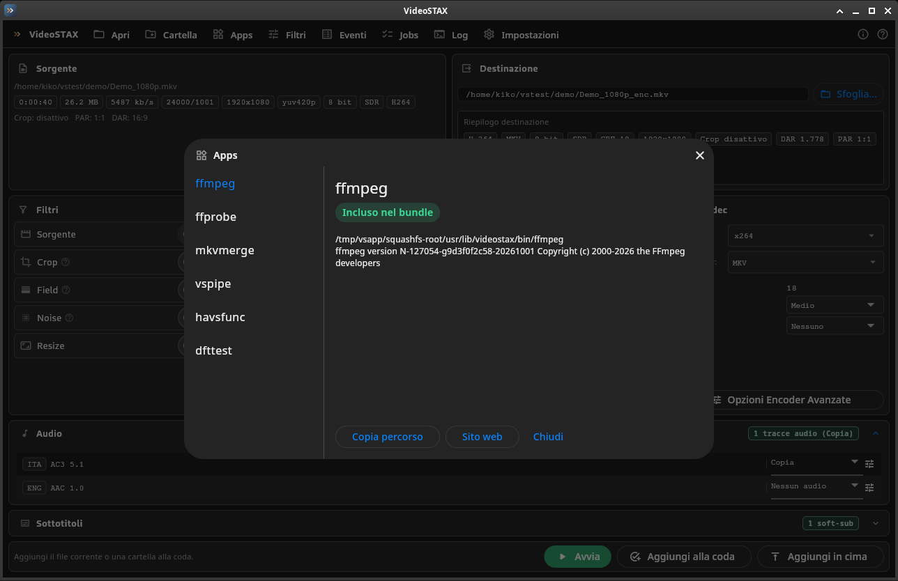

<h1 style="border: none; margin: 0 0 16px 0; padding: 0;">
  <table border="0" cellspacing="0" cellpadding="0" role="presentation" style="border: none; border-collapse: collapse; border-spacing: 0;">
    <tr>
      <td style="border: none; vertical-align: middle; padding: 0 18px 0 0; line-height: 1;">
        
      </td>
      <td style="border: none; vertical-align: middle; padding: 0;">
        VideoSTAX
      </td>
    </tr>
  </table>
</h1>

**Video transcoding studio for macOS, Windows and Linux** · **Studio di transcodifica video per macOS, Windows e Linux**

[](https://github.com/kikoz85/videostax-releases/releases/latest)
[](https://github.com/kikoz85/videostax-releases/releases)
[](#-download)

🇬🇧 **English** (below) · 🇮🇹 [**Italiano**](#-italiano)



---

## 🇬🇧 English

VideoSTAX compresses and converts video files. You open a file, choose how the result should look (codec, quality, size, audio and subtitle tracks) and VideoSTAX produces the new file, alone or in a queue of many files. Everything happens on one screen, in the spirit of StaxRip, on **macOS, Windows and Linux**.

It uses well-known tools under the hood (FFmpeg, MKVToolNix, VapourSynth) and the hardware encoders of your graphics card when available: **Apple VideoToolbox**, **NVIDIA NVENC**, **Intel Quick Sync** and **AMD VCE**. All tools are included in the download, so there is nothing else to install.

**Contents:** [Download](#-download) · [What's new](#-whats-new-in-093) · [Screenshots](#-screenshots) · [Features](#-features) · [Quick start](#-quick-start) · [Encoders](#-encoders) · [Requirements](#-system-requirements) · [Installation](#-installation) · [FAQ](#-faq-and-troubleshooting) · [Support](#-support-the-project)

### 📥 Download

Get the files from the **[latest release](https://github.com/kikoz85/videostax-releases/releases/latest)** (all versions: [Releases page](https://github.com/kikoz85/videostax-releases/releases)).

| Platform | File | How to install |
| :--- | :--- | :--- |
| **macOS** (Apple Silicon) | `VideoSTAX-v0.9.3-macOS.dmg` | Open the DMG and drag VideoSTAX to Applications |
| **Windows 10/11** (64-bit) | `VideoSTAX-v0.9.3-Windows-x64.zip` | Extract the folder and run `videostax_ui.exe` |
| **Linux** (any distribution, x86_64) | `VideoSTAX-v0.9.3-x86_64.AppImage` | `chmod +x` the file and run it |
| **Debian / Ubuntu / Mint** | `VideoSTAX-v0.9.3-amd64.deb` | `sudo apt install ./VideoSTAX-v0.9.3-amd64.deb` |
| **Fedora / openSUSE / RHEL** | `VideoSTAX-v0.9.3-x86_64.rpm` | `sudo dnf install ./VideoSTAX-v0.9.3-x86_64.rpm` (openSUSE: `sudo zypper install …`) |

Details for each system are in [Installation](#-installation).

### ✨ What's new in 0.9.3

- **macOS, much faster audio**: with the native VideoToolbox engine, AAC audio (including 5.1) is now encoded up to 8 times faster, with the same quality.
- **Accurate remaining time**: the time left and the progress bar (also on the Dock icon) now include the audio encode, so they no longer show "1 s" while the audio is still being processed.
- **Accurate size estimate**: the expected file size uses the real bitrates of your audio and subtitle tracks.

Full notes: [release 0.9.3](https://github.com/kikoz85/videostax-releases/releases/tag/v0.9.3).

<details>
<summary>What's new in 0.9.2</summary>

- **Remaining time on the app icon**: while encoding, the macOS Dock icon shows the time left and a progress bar, like HandBrake. On Windows the progress appears on the taskbar button.
- **Frame preview**: a thumbnail of the source; click it to compare the original and the result of crop and resize, with a draggable divider.
- **Clearer destination**: VideoSTAX lists only what changes from the source (codec, resolution, container), estimates the file size when you encode by bitrate, and warns you when an HDR video would be encoded at 8 bit.
- **Refreshed interface**: main encoder settings directly on the Codec card, advanced options with search and reset, numbered filter steps, recent files, progress in the bottom bar, keyboard shortcuts, improved light theme.
- Smaller macOS app.

Full notes: [release 0.9.2](https://github.com/kikoz85/videostax-releases/releases/tag/v0.9.2).

</details>

### 🖼️ Screenshots

| | |
| :---: | :---: |
|  |  |
| **Frame preview**: original vs result of crop and resize | **Start screen**: drop zone, quick open, recent files |
|  |  |
| **Encoder menu**: hardware encoders appear when detected | **Advanced options**: search, changed values, command line |
|  |  |
| **Audio tracks**: copy or convert each track | **Processing**: speed, bitrate, time left and log |
|  |  |
| **Jobs**: queue, order, start and per-job log | **Settings**: theme, languages, performance |
|  | |
| **Apps**: the bundled tools and their status | |

### 🧰 Features

#### One-screen workbench
- **Source** card: thumbnail of the video and its details at a glance: codec, resolution, frame rate, bit depth, HDR/SDR, duration, size, bitrate, chapters, number of audio and subtitle tracks.
- **Destination** card: output folder and file name (by default the source name with `_enc` in the same folder), a summary of what changes, an estimated file size for bitrate encodes, and warnings.
- **Filters**, **Resize** and **Codec** cards side by side; **Audio** and **Subtitles** panels below; the queue buttons at the bottom.

#### Opening files
- **Single file**, **multiple files** (added to the queue), **Blu-ray folder** (choose the playlist), **merge files** (join several files into one) and **batch file** (a list of files or folders).
- Drag and drop a video or a folder onto the window.
- The start screen remembers the last opened files.

#### Picture
- **Resize** with locked or free aspect ratio and live DAR/SAR/pixel information.
- **Crop** left, top, right and bottom.
- **Frame preview** to check crop and resize on any frame of the video before encoding.
- **Filters** (VapourSynth): deinterlacing with QTGMC, noise reduction with DFTTest, crop and resize. The steps always run in the correct order, shown by their number. Advanced users can write their own VapourSynth script.
- HDR sources keep their color information when encoded at 10 bit.

#### Encoding
- Codecs **H.264**, **H.265/HEVC** and **AV1** in software (x264, x265, SVT-AV1, libaom) or in hardware (see [Encoders](#-encoders)); **copy** to keep the original video; **command line** for your own FFmpeg arguments.
- Containers **MKV**, **MP4**, **MOV** and **WebM**.
- Constant quality (CRF/quality) or bitrate (VBR/CBR, 2-pass for x264/x265). The quality value has −/+ buttons right on the Codec card.
- Presets and tunes for every encoder, plus all the advanced options in a searchable dialog that shows the resulting command line.

#### Audio
- Every track can be **copied** unchanged or **converted** to AAC, AC-3, E-AC-3, FLAC, Opus or MP3.
- Bitrate, channels (original, stereo, mono), gain and **loudness normalization** for each track.
- Choose language, default track and order; preferred audio languages are selected automatically.
- Audio/video delay of the source is corrected automatically.
- On macOS, AAC is encoded with Apple's encoder, including 5.1 and 7.1.

#### Subtitles and chapters
- Each subtitle track can be **copied** (selectable in the player), **burned into the picture** or ignored; default and forced flags are kept.
- Chapters of the source are kept.

#### Queue and processing
- Add a job to the end or to the top of the queue, or start it right away.
- **Parallel jobs**, pause and resume, cancel, process priority (normal, below normal, low).
- The queue is saved automatically: after closing VideoSTAX you can reopen it with **Jobs → Load**.
- Processing panel with progress, speed (fps), bitrate, elapsed and remaining time, frames, phase (video, audio, mux) and full log.
- **When finished**: do nothing, close VideoSTAX, stand by, hibernate or shut down the computer.
- **Remaining time on the icon**: macOS Dock badge and progress bar; Windows taskbar progress.

#### Interface
- Dark and light theme, or follow the system.
- Languages: **English, Italian, German, Spanish, French**.
- Keyboard shortcuts (⌘ on macOS, Ctrl on Windows and Linux):

| Shortcut | Action |
| :--- | :--- |
| ⌘/Ctrl + O | Open a file |
| ⌘/Ctrl + Enter | Add the current file to the queue and start |
| ⌘/Ctrl + , | Settings |
| F6 | Jobs |
| F8 | Show or hide the log (processing panel) |
| Esc | Stop the running job (processing panel) |

### 🚀 Quick start

1. **Open** a video: drag it onto the window or click **Open**.
2. Check the **Source** card. Click the thumbnail if you want to see the frame preview.
3. In **Codec**, choose the encoder (for example x265, or a hardware encoder for more speed) and the container.
4. Set the **quality** with − and +: with CRF a lower number means higher quality and a bigger file (18–23 is a good range for x264/x265).
5. Optionally **resize** or **crop** in the Resize card, and choose the **audio** and **subtitle** tracks.
6. Look at the **Destination** summary, then click **Start** (or **Add to queue** to prepare more files and start them from **Jobs**).

### 🎛️ Encoders

Hardware encoders are much faster than software ones; software encoders usually give smaller files at the same quality. VideoSTAX shows a hardware encoder only when your computer has a compatible graphics card and driver.

| Encoder | macOS | Windows | Linux | Codecs |
| :--- | :---: | :---: | :---: | :--- |
| x264, x265, SVT-AV1, libaom | ✅ | ✅ | ✅ | H.264, H.265, AV1 |
| Apple VideoToolbox | ✅ | — | — | H.264, H.265 |
| NVIDIA NVEnc (NVEncC) | — | ✅ | ✅ | H.264, H.265, AV1* |
| Intel Quick Sync (QSVEncC) | — | ✅ | ✅ | H.264, H.265, AV1* |
| AMD VCE/AMF (VCEEncC) | — | ✅ | ✅ | H.264, H.265, AV1* |
| VAAPI | — | — | ✅ | H.264, H.265 |

\* AV1 hardware encoding requires a recent GPU that supports it.

### 💻 System requirements

| | macOS | Windows | Linux |
| :--- | :--- | :--- | :--- |
| **System** | macOS 27 or later, Apple Silicon (M1 or newer) | Windows 10 or 11, 64-bit | 64-bit distribution from the last few years (e.g. Ubuntu 22.04+, Fedora 38+) |
| **Memory** | 8 GB (16 GB recommended) | 8 GB (16 GB recommended) | 8 GB (16 GB recommended) |
| **Disk** | about 250 MB for the app | about 700 MB for the extracted folder | about 1.1 GB installed |
| **Display** | 1280×800 or larger | 1280×800 or larger | 1280×800 or larger, X11 or Wayland |
| **Hardware encoding** | built into every Apple Silicon Mac | NVIDIA, Intel or AMD GPU with up-to-date drivers | NVIDIA, Intel or AMD GPU with up-to-date drivers |

Keep free disk space of at least two to three times the size of the output file: some phases write temporary files that are deleted at the end.

### 📦 Installation

#### macOS
1. Open `VideoSTAX-v0.9.3-macOS.dmg` and drag **VideoSTAX** into **Applications**.
2. The first time, macOS may say the app is from an unidentified developer. Open **System Settings → Privacy & Security** and click **Open Anyway** next to VideoSTAX.
3. Settings are stored in `~/Library/Application Support/VideoSTAX`. To uninstall, drag the app to the Trash.

#### Windows
1. Extract `VideoSTAX-v0.9.3-Windows-x64.zip` to a folder of your choice (for example `C:\Programs\VideoSTAX`).
2. Run `videostax_ui.exe`. Keep the whole folder together: the `bin` folder contains the encoding tools.
3. If SmartScreen shows a warning, click **More info → Run anyway**.
4. Settings are stored in `%APPDATA%\VideoSTAX`. To uninstall, delete the folder.

#### Linux
- **AppImage** (any distribution):
  ```bash
  chmod +x VideoSTAX-v0.9.3-x86_64.AppImage
  ./VideoSTAX-v0.9.3-x86_64.AppImage
  ```
  If it does not start, install FUSE 2 (`libfuse2` on Ubuntu/Debian) or run it with `--appimage-extract-and-run`.
- **.deb** (Debian, Ubuntu, Mint): `sudo apt install ./VideoSTAX-v0.9.3-amd64.deb`
- **.rpm** (Fedora, RHEL): `sudo dnf install ./VideoSTAX-v0.9.3-x86_64.rpm` · openSUSE: `sudo zypper install ./VideoSTAX-v0.9.3-x86_64.rpm`
- With .deb and .rpm, VideoSTAX appears in the application menu and can be started with `videostax`. It is removed with `sudo apt remove videostax` or `sudo dnf remove videostax`.
- Settings are stored in `~/.config/VideoSTAX`.
- For hardware encoding, the GPU driver must be installed (NVIDIA proprietary driver, or Intel/AMD with VAAPI support).

### ❓ FAQ and troubleshooting

**A hardware encoder is missing from the menu.**
It appears only when the graphics card and the driver support it. Update the GPU driver and restart VideoSTAX. The **Apps** window shows which tools were found.

**Which quality should I choose?**
With x264/x265 a CRF between 18 and 23 is a good start (lower = better and bigger). With hardware encoders, use the quality value proposed by VideoSTAX and change it in small steps. The frame preview helps you check crop and size before encoding.

**My HDR video looks washed out or has banding.**
Encode HDR at **10 bit** (choose 10 bit in the Codec card). VideoSTAX shows a warning in the Destination card when HDR would be encoded at 8 bit.

**Can I burn subtitles into the picture?**
Yes, one track per job: set it to *Burn-in* in the Subtitles panel. Burn-in is not available when VapourSynth filters are enabled.

**Where is the encoded file?**
By default in the same folder as the source, with `_enc` added to the name. You can change folder and name in the Destination card.

**Can I close VideoSTAX while the queue is running?**
Closing stops the running jobs, but the queue is saved: reopen it with **Jobs → Load** and start it again.

### 💖 Support the project

VideoSTAX is developed and maintained independently. If it helps your video work, you can support new features and improvements:

👉 **[Sponsor VideoSTAX on GitHub](https://github.com/sponsors/kikoz85)**

Bug reports and suggestions are welcome in [Issues](https://github.com/kikoz85/videostax-releases/issues).

---

## 🇮🇹 Italiano

VideoSTAX comprime e converte file video. Apri un file, scegli come deve essere il risultato (codec, qualità, dimensioni, tracce audio e sottotitoli) e VideoSTAX crea il nuovo file, da solo o in una coda di tanti file. Tutto avviene in un'unica schermata, nello stile di StaxRip, su **macOS, Windows e Linux**.

Usa strumenti affermati (FFmpeg, MKVToolNix, VapourSynth) e, quando disponibili, gli encoder hardware della scheda video: **Apple VideoToolbox**, **NVIDIA NVENC**, **Intel Quick Sync** e **AMD VCE**. Gli strumenti sono già inclusi nel download: non serve installare altro.

**Indice:** [Download](#-download-1) · [Novità](#-novità-della-093) · [Schermate](#-schermate) · [Funzionalità](#-funzionalità) · [Guida rapida](#-guida-rapida) · [Encoder](#-encoder) · [Requisiti](#-requisiti-di-sistema) · [Installazione](#-installazione) · [Domande frequenti](#-domande-frequenti) · [Supporto](#-sostieni-il-progetto)

### 📥 Download

Scarica i file dall'**[ultima release](https://github.com/kikoz85/videostax-releases/releases/latest)** (tutte le versioni: [pagina Releases](https://github.com/kikoz85/videostax-releases/releases)).

| Piattaforma | File | Come installare |
| :--- | :--- | :--- |
| **macOS** (Apple Silicon) | `VideoSTAX-v0.9.3-macOS.dmg` | Apri il DMG e trascina VideoSTAX in Applicazioni |
| **Windows 10/11** (64 bit) | `VideoSTAX-v0.9.3-Windows-x64.zip` | Estrai la cartella e avvia `videostax_ui.exe` |
| **Linux** (qualsiasi distribuzione, x86_64) | `VideoSTAX-v0.9.3-x86_64.AppImage` | Rendi eseguibile il file con `chmod +x` e avvialo |
| **Debian / Ubuntu / Mint** | `VideoSTAX-v0.9.3-amd64.deb` | `sudo apt install ./VideoSTAX-v0.9.3-amd64.deb` |
| **Fedora / openSUSE / RHEL** | `VideoSTAX-v0.9.3-x86_64.rpm` | `sudo dnf install ./VideoSTAX-v0.9.3-x86_64.rpm` (openSUSE: `sudo zypper install …`) |

I dettagli per ogni sistema sono in [Installazione](#-installazione).

### ✨ Novità della 0.9.3

- **macOS, audio molto più veloce**: con il motore nativo VideoToolbox l'audio AAC (anche 5.1) viene codificato fino a 8 volte più velocemente, con la stessa qualità.
- **Tempo rimanente preciso**: tempo rimanente e barra di avanzamento (anche sull'icona nel Dock) includono ora la codifica dell'audio, quindi non mostrano più "1 s" mentre l'audio è ancora in lavorazione.
- **Stima della dimensione precisa**: la dimensione prevista del file usa i bitrate reali delle tracce audio e dei sottotitoli.

Note complete: [release 0.9.3](https://github.com/kikoz85/videostax-releases/releases/tag/v0.9.3).

<details>
<summary>Novità della 0.9.2</summary>

- **Tempo rimanente sull'icona**: durante la compressione l'icona nel Dock di macOS mostra il tempo che manca e una barra di avanzamento, come HandBrake. Su Windows l'avanzamento compare sul pulsante della barra delle applicazioni.
- **Anteprima del fotogramma**: miniatura della sorgente; cliccandola confronti originale e risultato di crop e ridimensionamento, con un divisore trascinabile.
- **Destinazione più chiara**: VideoSTAX elenca solo cosa cambia rispetto alla sorgente (codec, risoluzione, contenitore), stima la dimensione del file quando codifichi a bitrate e ti avvisa se un video HDR verrebbe codificato a 8 bit.
- **Interfaccia rinnovata**: impostazioni principali dell'encoder direttamente nella card Codec, opzioni avanzate con ricerca e ripristino, filtri numerati, file recenti, avanzamento nella barra in basso, scorciatoie da tastiera, tema chiaro migliorato.
- App per macOS più leggera.

Note complete: [release 0.9.2](https://github.com/kikoz85/videostax-releases/releases/tag/v0.9.2).

</details>

### 🖼️ Schermate

| | |
| :---: | :---: |
|  |  |
| **Anteprima**: originale e risultato di crop e resize | **Schermata iniziale**: area di rilascio, apertura rapida, file recenti |
|  |  |
| **Menu encoder**: gli encoder hardware compaiono se rilevati | **Opzioni avanzate**: ricerca, valori modificati, riga di comando |
|  |  |
| **Tracce audio**: copia o converti ogni traccia | **Elaborazione**: velocità, bitrate, tempo rimanente e log |
|  |  |
| **Jobs**: coda, ordine, avvio e log per ogni lavoro | **Impostazioni**: tema, lingue, prestazioni |
|  | |
| **Apps**: gli strumenti inclusi e il loro stato | |

### 🧰 Funzionalità

#### Tutto in una schermata
- Card **Sorgente**: miniatura del video e tutte le informazioni a colpo d'occhio: codec, risoluzione, frame rate, profondità colore, HDR/SDR, durata, dimensione, bitrate, capitoli, numero di tracce audio e sottotitoli.
- Card **Destinazione**: cartella e nome del file in uscita (di default il nome della sorgente con `_enc`, nella stessa cartella), riepilogo di cosa cambia, stima della dimensione per le codifiche a bitrate e avvisi.
- Card **Filtri**, **Resize** e **Codec** affiancate; pannelli **Audio** e **Sottotitoli** sotto; pulsanti della coda in basso.

#### Aprire i file
- **File singolo**, **più file** (aggiunti alla coda), **cartella Blu-ray** (con scelta della playlist), **unisci file** (più file in uno) e **file batch** (un elenco di file o cartelle).
- Trascina un video o una cartella sulla finestra.
- La schermata iniziale ricorda gli ultimi file aperti.

#### Immagine
- **Ridimensionamento** con proporzioni bloccate o libere e informazioni DAR/SAR/pixel in tempo reale.
- **Crop** a sinistra, in alto, a destra e in basso.
- **Anteprima del fotogramma** per controllare crop e ridimensionamento su qualunque punto del video prima di codificare.
- **Filtri** (VapourSynth): deinterlacciamento con QTGMC, riduzione del rumore con DFTTest, crop e resize. I passi vengono sempre eseguiti nell'ordine corretto, indicato dal numero. Gli utenti esperti possono scrivere un proprio script VapourSynth.
- Le sorgenti HDR mantengono le informazioni sul colore quando codificate a 10 bit.

#### Codifica
- Codec **H.264**, **H.265/HEVC** e **AV1** via software (x264, x265, SVT-AV1, libaom) o hardware (vedi [Encoder](#-encoder)); **copia** per mantenere il video originale; **riga di comando** per argomenti FFmpeg personalizzati.
- Contenitori **MKV**, **MP4**, **MOV** e **WebM**.
- Qualità costante (CRF/qualità) o bitrate (VBR/CBR, 2 passate per x264/x265). Il valore di qualità ha i pulsanti −/+ direttamente nella card Codec.
- Preset e tune per ogni encoder, più tutte le opzioni avanzate in una finestra con ricerca che mostra la riga di comando risultante.

#### Audio
- Ogni traccia può essere **copiata** senza modifiche o **convertita** in AAC, AC-3, E-AC-3, FLAC, Opus o MP3.
- Bitrate, canali (originale, stereo, mono), guadagno e **normalizzazione del volume** per ogni traccia.
- Scelta di lingua, traccia predefinita e ordine; le lingue audio preferite vengono selezionate in automatico.
- Il ritardo audio/video della sorgente viene corretto in automatico.
- Su macOS l'AAC è codificato con l'encoder Apple, anche in 5.1 e 7.1.

#### Sottotitoli e capitoli
- Ogni traccia di sottotitoli può essere **copiata** (attivabile nel player), **impressa nell'immagine** o ignorata; i flag predefinito e forzato vengono mantenuti.
- I capitoli della sorgente vengono mantenuti.

#### Coda ed elaborazione
- Aggiungi un lavoro in fondo o in cima alla coda, oppure avvialo subito.
- **Lavori in parallelo**, pausa e ripresa, annullamento, priorità del processo (normale, inferiore al normale, bassa).
- La coda viene salvata in automatico: dopo aver chiuso VideoSTAX la riapri con **Jobs → Carica**.
- Pannello di elaborazione con avanzamento, velocità (fps), bitrate, tempo trascorso e rimanente, frame, fase (video, audio, mux) e log completo.
- **Al termine**: non fare nulla, chiudi VideoSTAX, standby, ibernazione o spegnimento del computer.
- **Tempo rimanente sull'icona**: badge e barra nel Dock di macOS; avanzamento nella barra delle applicazioni di Windows.

#### Interfaccia
- Tema scuro, chiaro o automatico in base al sistema.
- Lingue: **italiano, inglese, tedesco, spagnolo, francese**.
- Scorciatoie da tastiera (⌘ su macOS, Ctrl su Windows e Linux):

| Scorciatoia | Azione |
| :--- | :--- |
| ⌘/Ctrl + O | Apri un file |
| ⌘/Ctrl + Invio | Aggiungi il file corrente alla coda e avvia |
| ⌘/Ctrl + , | Impostazioni |
| F6 | Jobs |
| F8 | Mostra o nascondi il log (pannello di elaborazione) |
| Esc | Interrompi il lavoro in corso (pannello di elaborazione) |

### 🚀 Guida rapida

1. **Apri** un video: trascinalo sulla finestra o clicca **Apri**.
2. Controlla la card **Sorgente**. Clicca la miniatura se vuoi l'anteprima del fotogramma.
3. In **Codec** scegli l'encoder (per esempio x265, o un encoder hardware per andare più veloce) e il contenitore.
4. Imposta la **qualità** con − e +: con il CRF un numero più basso significa qualità più alta e file più grande (tra 18 e 23 è un buon intervallo per x264/x265).
5. Se serve, **ridimensiona** o fai il **crop** nella card Resize, e scegli le tracce **audio** e **sottotitoli**.
6. Guarda il riepilogo in **Destinazione**, poi clicca **Avvia** (oppure **Aggiungi alla coda** per preparare più file e avviarli da **Jobs**).

### 🎛️ Encoder

Gli encoder hardware sono molto più veloci di quelli software; quelli software di solito producono file più piccoli a parità di qualità. VideoSTAX mostra un encoder hardware solo se il computer ha una scheda video e un driver compatibili.

| Encoder | macOS | Windows | Linux | Codec |
| :--- | :---: | :---: | :---: | :--- |
| x264, x265, SVT-AV1, libaom | ✅ | ✅ | ✅ | H.264, H.265, AV1 |
| Apple VideoToolbox | ✅ | — | — | H.264, H.265 |
| NVIDIA NVEnc (NVEncC) | — | ✅ | ✅ | H.264, H.265, AV1* |
| Intel Quick Sync (QSVEncC) | — | ✅ | ✅ | H.264, H.265, AV1* |
| AMD VCE/AMF (VCEEncC) | — | ✅ | ✅ | H.264, H.265, AV1* |
| VAAPI | — | — | ✅ | H.264, H.265 |

\* La codifica AV1 hardware richiede una scheda video recente che la supporti.

### 💻 Requisiti di sistema

| | macOS | Windows | Linux |
| :--- | :--- | :--- | :--- |
| **Sistema** | macOS 27 o successivo, Apple Silicon (M1 o più recente) | Windows 10 o 11, 64 bit | Distribuzione a 64 bit degli ultimi anni (es. Ubuntu 22.04+, Fedora 38+) |
| **Memoria** | 8 GB (consigliati 16 GB) | 8 GB (consigliati 16 GB) | 8 GB (consigliati 16 GB) |
| **Disco** | circa 250 MB per l'app | circa 700 MB per la cartella estratta | circa 1,1 GB installato |
| **Schermo** | 1280×800 o superiore | 1280×800 o superiore | 1280×800 o superiore, X11 o Wayland |
| **Codifica hardware** | integrata in ogni Mac Apple Silicon | scheda NVIDIA, Intel o AMD con driver aggiornati | scheda NVIDIA, Intel o AMD con driver aggiornati |

Tieni libero sul disco almeno due o tre volte la dimensione del file finale: alcune fasi scrivono file temporanei che vengono cancellati alla fine.

### 📦 Installazione

#### macOS
1. Apri `VideoSTAX-v0.9.3-macOS.dmg` e trascina **VideoSTAX** in **Applicazioni**.
2. Al primo avvio macOS potrebbe dire che l'app proviene da uno sviluppatore non identificato. Apri **Impostazioni di Sistema → Privacy e sicurezza** e clicca **Apri comunque** accanto a VideoSTAX.
3. Le impostazioni sono salvate in `~/Library/Application Support/VideoSTAX`. Per disinstallare, trascina l'app nel Cestino.

#### Windows
1. Estrai `VideoSTAX-v0.9.3-Windows-x64.zip` in una cartella a tua scelta (per esempio `C:\Programmi\VideoSTAX`).
2. Avvia `videostax_ui.exe`. Tieni la cartella completa: la sottocartella `bin` contiene gli strumenti di codifica.
3. Se SmartScreen mostra un avviso, clicca **Ulteriori informazioni → Esegui comunque**.
4. Le impostazioni sono salvate in `%APPDATA%\VideoSTAX`. Per disinstallare, elimina la cartella.

#### Linux
- **AppImage** (qualsiasi distribuzione):
  ```bash
  chmod +x VideoSTAX-v0.9.3-x86_64.AppImage
  ./VideoSTAX-v0.9.3-x86_64.AppImage
  ```
  Se non parte, installa FUSE 2 (`libfuse2` su Ubuntu/Debian) oppure avvialo con `--appimage-extract-and-run`.
- **.deb** (Debian, Ubuntu, Mint): `sudo apt install ./VideoSTAX-v0.9.3-amd64.deb`
- **.rpm** (Fedora, RHEL): `sudo dnf install ./VideoSTAX-v0.9.3-x86_64.rpm` · openSUSE: `sudo zypper install ./VideoSTAX-v0.9.3-x86_64.rpm`
- Con .deb e .rpm VideoSTAX compare nel menu delle applicazioni e si avvia anche con `videostax`. Si rimuove con `sudo apt remove videostax` o `sudo dnf remove videostax`.
- Le impostazioni sono salvate in `~/.config/VideoSTAX`.
- Per la codifica hardware serve il driver della scheda video (driver proprietario NVIDIA, oppure Intel/AMD con supporto VAAPI).

### ❓ Domande frequenti

**Nel menu manca un encoder hardware.**
Compare solo se la scheda video e il driver lo supportano. Aggiorna il driver e riavvia VideoSTAX. La finestra **Apps** mostra quali strumenti sono stati trovati.

**Che qualità devo scegliere?**
Con x264/x265 un CRF tra 18 e 23 è un buon punto di partenza (più basso = migliore e più grande). Con gli encoder hardware usa il valore proposto da VideoSTAX e cambialo a piccoli passi. L'anteprima del fotogramma ti aiuta a controllare crop e dimensioni prima di codificare.

**Il mio video HDR esce slavato o con bande di colore.**
Codifica l'HDR a **10 bit** (scegli 10 bit nella card Codec). VideoSTAX mostra un avviso nella card Destinazione quando un HDR verrebbe codificato a 8 bit.

**Posso imprimere i sottotitoli nell'immagine?**
Sì, una traccia per lavoro: impostala su *Impressione (burn-in)* nel pannello Sottotitoli. Non è disponibile quando sono attivi i filtri VapourSynth.

**Dove trovo il file codificato?**
Di default nella stessa cartella della sorgente, con `_enc` aggiunto al nome. Puoi cambiare cartella e nome nella card Destinazione.

**Posso chiudere VideoSTAX mentre la coda è in corso?**
La chiusura interrompe i lavori in corso, ma la coda è salvata: riaprila con **Jobs → Carica** e avviala di nuovo.

### 💖 Sostieni il progetto

VideoSTAX è sviluppato e mantenuto in modo indipendente. Se ti è utile, puoi sostenere nuove funzioni e miglioramenti:

👉 **[Sostieni VideoSTAX su GitHub](https://github.com/sponsors/kikoz85)**

Segnalazioni di bug e suggerimenti sono benvenuti nelle [Issues](https://github.com/kikoz85/videostax-releases/issues).

---

## 📄 Licenses · Licenze

VideoSTAX includes third-party open source software (FFmpeg, MKVToolNix, VapourSynth and plugins, Rigaya encoders, Flutter, fonts and others), each under its own license. See **[THIRD_PARTY_LICENSES.md](THIRD_PARTY_LICENSES.md)**; the same notices are in the app's **About** window (**Info** button on Windows and Linux, **VideoSTAX** menu on macOS) under **Third-party licenses**.

VideoSTAX include software open source di terze parti, ognuno con la propria licenza: vedi **[THIRD_PARTY_LICENSES.md](THIRD_PARTY_LICENSES.md)** e, nell'app, la finestra **Informazioni** (pulsante **Info** su Windows e Linux, menu **VideoSTAX** su macOS) alla voce **Licenze di terze parti**.

## ✉️ Contact · Contatti

**Enrico Fanucchi** — [enricofanucchi@gmail.com](mailto:enricofanucchi@gmail.com) · [www.enricofanucchi.com](https://www.enricofanucchi.com)
